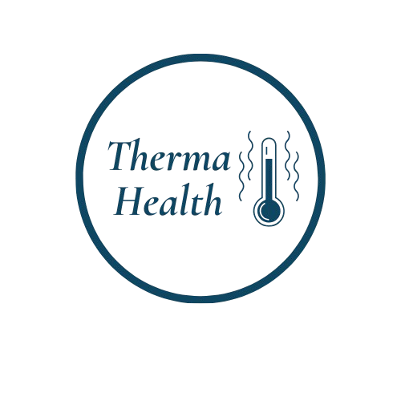

# ThermaHealth

## Índice

1. Descrição do Projeto
2. Contexto
3. Objetivo
4. Características do projeto
5. Tecnologias utilizadas 
6. Contribuições

## Descrição do Projeto

O projeto consiste no desenvolvimento de um sensor de temperatura e umidade para monitoramento contínuo das alas de um hospital, operando 24 horas por dia. Os dados coletados serão transmitidos em tempo real para um site e demonstrados através de um dashboard, permitindo acesso remoto e registro histórico. Isso garantirá um controle preciso, contribuindo para a segurança e conforto de pacientes, e profissionais. O sistema facilitará a detecção de variações críticas, auxiliando na manutenção da climatização hospitalar. 

## Contexto

O modelo de negócio de uma unidade hospitalar é impactado negativamente pela permanência prolongada de pacientes, que ocupa leitos, aumenta custos com insumos, máquinas e trabalho dos profissionais de saúde. Esse problema é agravado por falhas nos processos hospitalares, que podem levar à contaminação de pacientes e insumos, prejudicando a reputação da unidade. Uma solução para reduzir esses custos e riscos é o monitoramento da temperatura e umidade das salas, criando um ambiente favorável à recuperação dos pacientes e desfavorável à proliferação de micro-organismos, tornando o processo de recuperação mais seguro, eficiente e econômico.

## Objetivo

•	**Monitoramento de temperatura e umidade em tempo real:** Desenvolver um sistema de sensores para medir continuamente a temperatura e umidade das salas hospitalares.  
•	**Alerta visual:** Implementar notificações automáticas sobre variações perigosas de temperatura e umidade. 
•	**Reduzir as taxas de infecções hospitalares:** Acelerar o processo de recuperação dos pacientes internados, resultando na redução de custos por paciente e evitando multas por falta de monitoramento de temperatura e umidade no hospital. 

## Características do Projeto
- **Captura em tempo real** das informações de temperatura e umidade;
- **Armazenamento e processamento** das informações coletadas;
- **Visualização dos dados** por meio de um dashboard em um site institucional;
- **Alertas** quando ocorrerem alterações além dos limites pré-estabelecidos para cada sala;*

## Tecnologias utilizadas:

## Contribuições
- [GUSTAVO DE OLIVEIRA](https://github.com/Gustavo01833)
- [LUCA DIAS](https://github.com/twitterpontocom)
- [LUCAS CALIL](https://github.com/Calil30)
- [MARINA KOGA](https://github.com/koga010)
- [REBECA OLIVEIRA](https://github.com/RebecaOlive)
- [SAMUEL ANDRADE](https://github.com/Samuel-sptech)